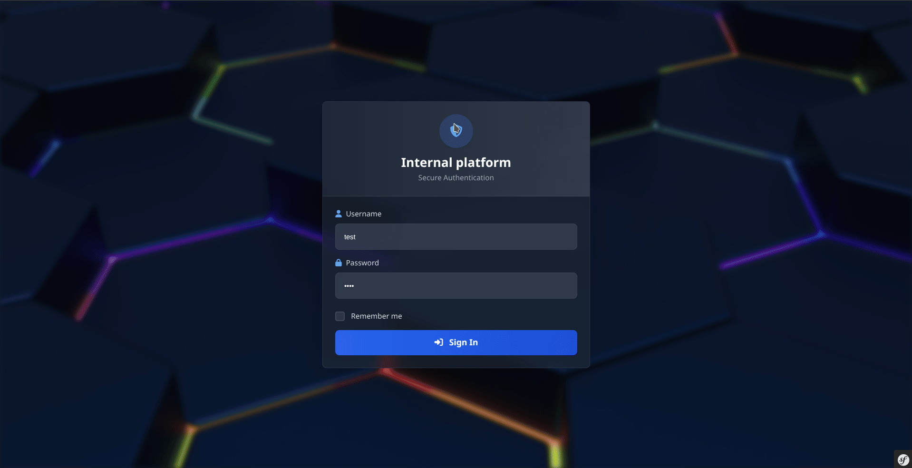

# <h1 align="center">Internal platform base</h1>
### 
Solution for building internal systems

    <a href="LICENSE" target="_blank">License</a> |
    <a href="https://becvar.xyz" target="_blank">Author website</a>

## Dashboard preview

## Usage example
An example usage of this base is the [admin-suite](https://github.com/lukasbecvar/admin-suite)

## Description
Base app template for building internal applications on symfony framework.
This template includes components: login system, user management, logs, account settings, basic dashboard, and other essential features needed in app to application development — for example, for intranet, ERP systems, and similar use cases.

## Tech stack
#### Development
The complete stack for development is in Docker Compose, including PHP, Node, and Composer. You just need to run the ``sh docker-start-dev.sh`` script to launch it.

## Index
- [Requirements](#requirements)
- [Installation](#installation)
- [Configuration](#configuration)
- [Authentication](#authentication)
- [Notifications](#notifications)
- [Logging](#logging)
- [Dependencies](#dependencies)
- [License](#license)

## Requirements
#### Software
* PHP 8.4 and compatible web server
* MySQL 8 or higher
* Composer
* NPM
#### PHP extensions
* PHP-PDO extension (db driver)
* PHP-OpenSSL extension
* PHP-Intl extension
* PHP-Curl extension
* PHP-DOM extension
* PHP-GMP extension
* PHP-GD extension

## Installation
Installation is very simple like any other PHP project.
* Clone repo ``git clone git@github.com:lukasbecvar/admin-suite.git``
* Create apache virtual host or nginx configuration like ([apache-config](.docker/configs/apache-site.conf))
* Create .env file with your configuration (.env.prod)
* Install dependencies ``npm install && composer install``
* Build frontend assets ``npm run build``
* Create database ``php bin/console doctrine:database:create --if-not-exists``
* Migrate database ``php bin/console doctrine:migrations:migrate --no-interaction``
* Create systemd service for monitoring process (console command infinite loop) ([systemd-config](.docker/configs/monitoring-systemd.service))
* Create main admin user using console command or web interface (webinterface allows to create user if users table is empty)

## Configuration
#### Environment variables
The environment variables are loaded from .env file. You can create .env file in root directory with your configuration.
| Variable | Description | Example value |
| --- | --- | --- |
| APP_ENV | Application environment | prod |
| APP_SECRET | Secret encryption key | 0cb9325e8b4b59a90249865085 |
| TRUSTED_HOSTS | Trusted url hosts | becvar.xyz,becvar.test |
| SSL_ONLY | Enable only ssl traffic | true |
| MAINTENANCE_MODE | Enable maintenance mode | true |
| PWA_APP_SUPPORT | Enable pwa app support | true |
| ADMIN_CONTACT | The system maintener contact email | admin@becvar.xyz |
| IP_APIS | The list of APIs to get host server pulic ip | IP_APIS=IP_APIS=https://ifconfig.me,url2,url2 |
| IP_INFO_API | API for get information about visitor ip | http://ip-api.com |
| EXTERNAL_API_LOG_TOKEN | Token for external api logging | 1234567890 |
| ANTI_LOG_TOKEN | Token for disable logging | 1234567890 |
| DATABASE_LOGGING | Enable database logging | true |
| LOG_LEVEL | Log level | 4 |
| MEMORY_COST | Hash memory cost | 1024 |
| TIME_COST | Hash time cost | 10 |
| THREADS | Hash threads | 2 |
| LIMIT_CONTENT_PER_PAGE | Limit items per page | 10 |
| DATABASE_DRIVER | Database driver | pdo_mysql |
| DATABASE_HOST | Database host | localhost |
| DATABASE_PORT | Database port | 3306 |
| DATABASE_NAME | Database name | admin_suite |
| DATABASE_USERNAME | Database user | root |
| DATABASE_PASSWORD | Database password | root |
| MAILER_ENABLED | Enable mailer | true |
| MAILER_HOST | Mailer host | localhost |
| MAILER_PORT | Mailer port | 25 |
| MAILER_USERNAME | Mailer username | service@becvar.xyz |
| MAILER_PASSWORD | Mailer password | password |
| PUSH_NOTIFICATIONS_ENABLED | Enable push notifications | true |
| PUSH_NOTIFICATIONS_MAX_TTL | Push notifications max ttl | 86400 |
| PUSH_NOTIFICATIONS_CONTENT_ENCODING | Push notifications content encoding | aes-256-gcm |
| PUSH_NOTIFICATIONS_VAPID_PUBLIC_KEY | Public key for push notifications | 12938747T6T6R236 |
| PUSH_NOTIFICATIONS_VAPID_PRIVATE_KEY | Private key for push notifications | 12938747T6T6R236 |
#### Suite configuration
The default admin suite configuration is stored in json files in config/suite directory. You can create your own configuration files in app root and override default configuration.
* config/suite/blocked-usernames.json - list of blocked usernames
* config/suite/exceptions-monitoring.json - list of paths to exception log files
* config/suite/package-requirements.json - list of packages and php extensions to be installed
* config/suite/services-monitoring.json - list of services to be monitored
* config/suite/terminal-aliases.json - list of terminal aliases
* config/suite/terminal-blocked-commands.json - list of blocked terminal commands

## Authentication
Authentication uses a completely custom user system with a username and password, managed by the application user manager. Only the first user can use the registration form to create admin user. Login uses standard PHP session and cookie for the 'remember me' feature.

## Notifications
Notifications from application are sent to admin users via web push notifications if the admin enables them. It also allows sending alerts directly to the admin's email.

## Logging
The system allows storing actions in the database to track the actions of admin suite users and also receive logs from external applications via an API.

## Contributing
Contributions are welcome! Please fork this repository and submit pull requests for any features, bug fixes, or enhancements. If you have any questions or need help, feel free to open an issue or contact me directly.

## Dependencies
* PHP
    * [Website](https://php.net)
* Symfony with doctrine
    * [Website](https://symfony.com)
* PHPUnit
    * [Github](https://github.com/sebastianbergmann/phpunit)
* Better PHPUnit CLI output
    * [Github](https://github.com/robiningelbrecht/phpunit-pretty-print)
* PHPStan
    * [Github](https://github.com/phpstan/phpstan)
* Tailwind
    * [Website](https://tailwindcss.com)
* NPM / Webpack encore
    * [NPM](https://docs.npmjs.com)
    * [Encore](https://symfony.com/doc/current/frontend/encore/index.html)

## License
This software is licensed under the [MIT license](LICENSE). 
